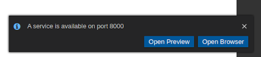
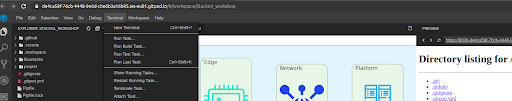
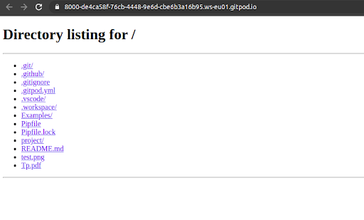
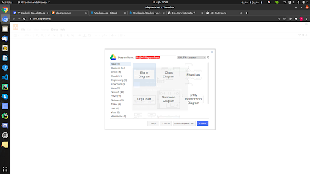
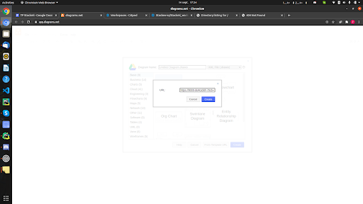

# Stkml workshop

#Practical work

Objectif : l’objectif de cette série d’exercices est de t’aider à décrire, en stkml, une architecture de système IoT bout en bout, pas à pas, en suivant la méthodologie TENPA. 

A la fin des 90 minutes tu devrais avoir finalisé les 7 steps et constitué:


*   Le fichier principal de ton architecture
*   Les fichiers de bibliothèques d'entités que tu importes
*   Le diagramme général du système 
*   Le diagramme en couches du système
*   La topologie de deploiement
*   La carte du déploiement

La documentation est accessible en ligne: [stkml.stackeo.io](https://stkml.stackeo.io)
, [pypi.org/project/stkml/](https://pypi.org/project/stkml/)

Si vous avez des questions vous pouvez les envoyer sur le canal : [https://stkml.slack.com/archives/C01C1DQNXQ9
](https://stkml.slack.com/archives/C01C1DQNXQ9)


## Step #1 : Setup 


1. Se connecter sur Gitpod
2. Aller à [](https://gitpod.io/#https://github.com/Stackeo-io/stkml_workshop)
3. Cliquer sur Open Preview 

    



4. Ouvrir un nouveau terminal


      



5.  Installer stkml : pip install stkml
6.  Tester l’exemple:
    a. Visualiser  le projet Examples/Bricoloc/level1 
    b. Checker le projet : stkml check -i Examples/Bricoloc/level1/
    c. Introduire une erreur syntaxique et rechercher puis corriger
    d. Générer un image général du système:
        
        -   stkml compile -i Examples/Bricoloc/level1/ diagram -t 1 -o diagramm1 
        -   ouvrir en cliquant sur le fichier ou avec la preview web (actualiser la page)
         
    e. Générer un diagramme du système, editable:
        -  stkml compile -i Examples/Bricoloc/level1/ drawio -l 1 -o drawio1 -i Examples/Bricoloc/icons/ 
        -  ouvrir avec [https://app.diagrams.net/](https://app.diagrams.net/) en utilisant le URL du fichier drawio à partir de la preview
            
            
            
    
    f. Générer un diagramme editable des couches du système (niveau 2) :
    
        -   stkml compile -i Examples/Bricoloc/level2 drawio -l 2 -o drawio2 
        -   ouvrir avec [https://app.diagrams.net/](https://app.diagrams.net/) en utilisant le URL du fichier drawio à partir de la preview
        
    g. Générer la topologie de déploiement:
    
        -   stkml compile -i Examples/Bricoloc/level1/ diagram -t 2 -o diagramm2
        -    ouvrir en cliquant sur le fichier ou avec l'interface web
        
    h. Générer la carte de déploiement:
    
        -   stkml compile -i Examples/Bricoloc/level1/ diagram -t 3 -o diagramm3 -i Examples/Bricoloc/icons/
        -   ouvrir avec l'interface web

    


```
Rajouter toujours l'extension .stkml.yaml au fichiers stkml
Utiliser ctrl+space pour l'autocomplete et les suggestions 
```


## Step #2 : Preparation du Use Case


1. Preparer votre use case (sketch de l’architecture de votre système).
2. Identifier la liste des tiers requis Things, Edge, Network, Platform, Application 
3. Rechercher si les bibliothèques de modèles de nodes requis existent, sinon, il vous faudra créer les fichiers correspondants (voir Step4).
4. Lister l’inventaire les modèles de nodes nécessaires.
5. Réfléchir aux liens entre ces nodes


## Step #3 : Création de la topologie logique (niveau 1)


1. Développer le fichier principal (main) de votre use case
2. Créer un nouveau répertoire
3. stkml init (éventuellement -p nomrep)
4. Ouvrir le fichier main
5. Définir le niveau 1 du système de votre use case : level 1
6. Importer les bibliothèques correspondantes. Si elles n’existent pas passer au step #4 suivant puis revenir ici.
7. Décrire la topologie logique en lisstant les nodes (id, model, link) puis les links entre ces nodes (source & sink)
8. Checker le fichier
9. Generer le diagram type 1 de diagram et drawio .


## Step #4 : création des bibliothèques de modèles de nodes (niveau1)


1. Développer les fichiers à importer dans votre use case (niveau1) (rajouter l’extension stkml.yaml pour bénéficier de l’autocomplete et la vérification syntaxique instantanée) 
2. Développer le fichier des modèles de Things, de Edge (par exemple Kotron), de network, des Platform, d’applications
3. Par exemple pour un fichier de modèle de edge gateway, créer le fichier Kotron.stkml.yaml
4. Definir le modele KBoxA203


## Step #5 : Modélisation en couche de la topologie (niveau2)


1. Détailler le fichier main pour définir les layer.
2. Importer les bibliothèques détaillées correspondantes à votre use case. Si elles ne sont pas détaillées passer au  step 6.
3. Pour définir le niveau 2 du système, c’est à dire les layers éléments au sein de chaque node et les liens entre les composants des nodes, il suffit d'ajouter le nom des layers correspondantes aux différentes relations de votre use case comme attribut des links.
4. Checker le fichier
5. Générer le diagram drawio correspondent  (-l 2)


## Step #6 : Détailler les bibliothèques de modèles de nodes (niveau2)


1. Détailler  les fichiers à importer dans votre use case (niveau 2)
2. Reprendre les fichiers des modèles de Things, de Edge (par exemple Kotron), de network, des Platform, d’applications
3. Pour chacun, il faudra, le cas échéant, décrire
    1.  la layer energy
    2. la layer physical avec ses composants
    3. layer network avec ses composants
    4. la layer connectivity
    5. la layer data


## Step #7 : Définir le déploiement : regions et populations


1. Détailler le fichier main pour définir les régions en dessous de la topologie, puis dans chaque région les populations de nodes a déployer.
2. Introduire la section Régions (name, type)  et pour chacune détailler  le nombre de nodes (population)
3. Checker le fichier
4. Générer la carte (map) du déploiement.
